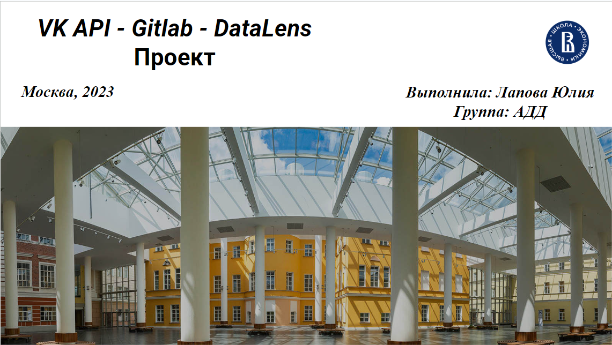
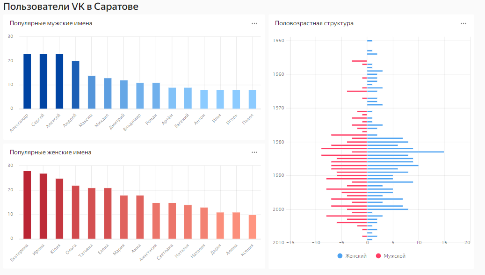

# HW1_VK Проект по анализу данных пользователей VK с использованием API

## Выполнила: Лапова Юлия

### Группа: АДД

### Москва, 2023

## Описание проекта

Данный проект направлен на анализ и сбор данных пользователей социальной сети ВКонтакте с использованием VK API. Цель проекта — получение и визуализация статистики по пользователям из города Саратов для выявления самых популярных женских и мужских имен, а также исследование половозрастной структуры. Работа включает в себя использование Jupyter Notebook для сбора данных, DataLens для визуализации результатов и Gitlab для контроля версий и организации процесса разработки.

## Основные этапы проекта:

- Получение ключа доступа (access token) для VK API.
- Определение city_id города Саратов в Jupyter Notebook для получения списка пользователей.
- Извлечение и сохранение данных в формате .CSV.
- Визуализация данных с использованием Yandex DataLens.
- Подготовка отчета и презентации о проделанной работе.

## Инструкции по работе с проектом:

- Исходный код проекта выложен в Gitlab репозиторий HW1_VK.
- Организация работы над проектом ведется через систему Git.
- Визуализация данных и отчет о проделанной работе доступны через Yandex DataLens.

## Использованные технологии:

- VK API для получения данных с сайта ВКонтакте.
- Jupyter Notebook для выполнения кода и получения данных.
- DataLens для создания визуализации и BI-отчетов.
- Git для системы контроля версий.
- Gitlab для совместной работы и трекинга процесса разработки.

### Примеры визуализации данных:

### Ссылка на DataLens дашборд

Для доступа к интерактивному дашборду перейдите по следующей ссылке:
[DataLens Дашборд](https://datalens.yandex.ru/1mgtm2bossd0q-polzovateli-vk-v-saratove)

### Ссылка на презентацию

Для просмотра презентации перейдите по следующей ссылке:
[Презентация](https://docs.google.com/presentation/d/1tRy9IM0z7cSGlR8uJ2lbRg7lKi6Z3Zn3/edit?usp=sharing&ouid=105790878003907527731&rtpof=true&sd=true)

## Контакты

Если у вас есть вопросы по проекту, вы можете связаться со мной через email: [Лапова Юлия](mailto:lapovajulia1983@gmail.com)
